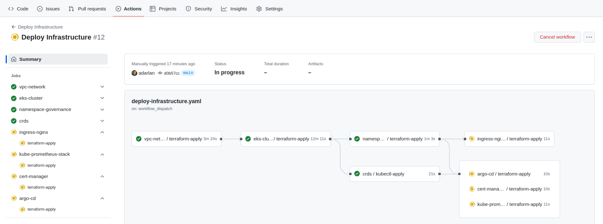

# EKS Lab

This project automates the deployment of an Amazon EKS cluster on AWS using Terraform and GitHub Actions. Designed for experimentation, it comes pre-integrated with open-source tools and example applications.

## Key Components

- __Amazon EKS__ – Managed __Kubernetes__ cluster
- __Amazon VPC__ – Networking setup for the cluster
- __Amazon Route 53__ – DNS management
- __Amazon IAM__ + __OpenID Connect__ – Secure AWS authentication without static credentials
- __Terraform__ + __HCP Terraform__ – Infrastructure as code with remote execution and state management
- __GitHub Actions__ – Automated workflows
- __Argo CD__ – Continuous delivery
- __Ingress-Nginx__ – Traffic routing
- __Cert-Manager__ + __Let’s Encrypt__ – Automated TLS certificate issuance
- __Prometheus__ – Metrics scraping
- __Grafana__ – Dashboard visualization
- __Docker__ – Container image building
- __Amazon ECR__ – Container image storage
- __Helm__ – Kubernetes manifest packaging

## Prerequisites

Ensure you have the following:

- AWS account
- GitHub account
- HCP Terraform account
- Installed and authenticated CLI tools:
  - `aws` CLI with administrator access to your AWS account
  - `gh` CLI authenticated with your GitHub user
  - `terraform` CLI authenticated with your HCP Terraform user
- A registered domain (from any registrar)
- An Amazon Route 53 hosted zone for your domain, with its name servers configured in your domain’s DNS settings

## 1. Create Your Own Private Repository

Since this project requires configurations for your cloud accounts, it's recommended to work on your own private repository. GitHub doesn't allow changing a fork’s visibility to private, so instead of forking, you'll need to clone the repository and push it to a new private repository.

Follow these steps:

```shell
# Clone the public repository
git clone https://github.com/adarlan/eks-lab.git

# Navigate into the project directory
cd eks-lab

# Create a new private repository
gh repo create my-private-eks-lab --private

# Set the 'origin' remote to your new private repository
git remote set-url origin git@github.com:$(gh api user --jq .login)/my-private-eks-lab.git

# Push the code to your private repository
git push -u origin main
```

To pull updates from the public repository:

```shell
# Add the 'upstream' remote URL
git remote add upstream https://github.com/adarlan/eks-lab.git

# Set your private repository as the GitHub CLI default repository
gh repo set-default $(gh api user --jq .login)/my-private-eks-lab

# Fetch and merge updates
git fetch upstream
git merge upstream/main
```

## 2. Cloud Setup 🌥️

This repository is organized into multiple modules, each with its own independent configuration. Among them, `cloud-setup` is a foundational module. While it doesn’t provision the cluster infrastructure or deploy workloads, it establishes the necessary integrations between AWS, GitHub, and HCP Terraform, ensuring other modules have the required configurations, credentials, and permissions.

It provisions:

- AWS IAM roles and OIDC providers for HCP Terraform and GitHub Actions
- HCP Terraform workspaces, variables, and API tokens
- GitHub secrets and variables for workflows

Create a `cloud-setup/terraform.tfvars` file with the following values, replacing them as needed:

```conf
github_repository          = "eks-lab"
aws_region                 = "us-east-1"
hcp_terraform_organization = "example-org"

domain = "example.com"

hosts = {
  hello_world = "hello.example.com"
  crud_api    = "crud.example.com"
  argocd      = "argocd.example.com"
  grafana     = "grafana.example.com"
  prometheus  = "prometheus.example.com"
}

acme_email = "example@example.com"
```

Edit the `cloud-setup/terraform.tf` file and replace the `cloud {}` block with the following configurations, replacing the values as needed:

```tf
  cloud {
    organization = "example-org"
    workspaces {
      name = "my-private-eks-lab-cloud-setup"
    }
  }
```

Run the following commands to initialize and apply the `cloud-setup` module:

```shell
export TF_FORCE_LOCAL_BACKEND=1
terraform -chdir=cloud-setup init
terraform -chdir=cloud-setup apply
```

This applies the `cloud-setup` configuration, storing Terraform state in the designated HCP Terraform workspace. Terraform executes locally for this module to leverage the current user's credentials.

## 3. Deploy 🚀

With the foundational setup complete, trigger the deployment workflow to:

- Provision the EKS cluster and supporting infrastructure (VPC, Route 53, etc.)
- Create Kubernetes namespaces and apply Custom Resource Definitions (CRDs)
- Install essential tools and services (Ingress-Nginx, Cert-Manager, etc.)
- Build and deploy example applications (a Hello World app and a CRUD API with its client)

To start the deployment:

- Go to your GitHub repository
- Navigate to the __Actions__ tab
- Select the __Deploy__ workflow
- Click __Run workflow__

Once triggered, you can monitor the workflow progress in GitHub Actions:



## 5. Next Steps 🎯

- Access your applications via the configured domain
- Monitor metrics with Grafana and Prometheus
- Experiment with Kubernetes workloads

## 6. Undeploy 💥

To delete resources and avoid unnecessary costs:

- Go to your GitHub repository
- Navigate to the __Actions__ tab
- Select the __Undeploy__ workflow
- Click __Run workflow__
