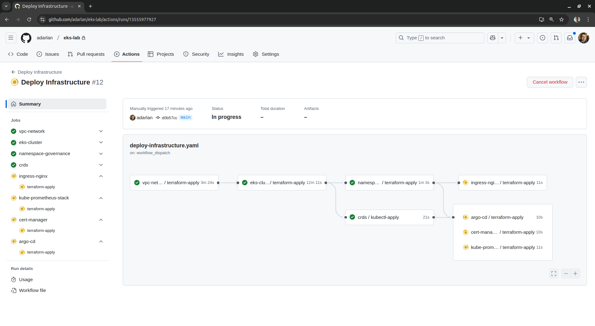

# EKS Lab

An __Amazon EKS__ experimentation project packed with open-source tools and example applications.

It automates __Kubernetes__ cluster setup using __Terraform__ and __Helm__, integrating:

- __Amazon VPC__ for networking
- __Amazon Route 53__ for DNS management
- __Ingress-Nginx__ for traffic routing
- __Cert-Manager__ for automated TLS certificate issuance
- __Prometheus__ for metrics scraping
- __Grafana__ for dashboard visualization
- __GitHub Actions__ for deployment automation
- __Argo CD__ for continuous deployment

## Prerequisites

Before getting started, make sure you have the following:

- __GitHub__ account – [sign up](https://github.com/signup) or [log in](https://github.com/login) and ensure the `gh` CLI is [installed](https://github.com/cli/cli#installation) and [authenticated](https://cli.github.com/manual/gh_auth_login).
- __AWS__ account – [sign up](https://portal.aws.amazon.com/billing/signup) or [log in](https://console.aws.amazon.com/console/home?nc2=h_ct&src=header-signin) and ensure the `aws` CLI is [installed](https://docs.aws.amazon.com/cli/latest/userguide/getting-started-install.html) and [authenticated](https://awscli.amazonaws.com/v2/documentation/api/latest/reference/configure/index.html).
- __HCP Terraform__ account – [sign up](https://app.terraform.io/public/signup/account) or [log in](https://app.terraform.io/session) and ensure the `terraform` CLI is [installed](https://developer.hashicorp.com/terraform/install) and [authenticated](https://developer.hashicorp.com/terraform/cli/commands/login).
- Registered __domain__ – Ensure you have a domain with an [Amazon Route 53 hosted zone set up for DNS management](https://docs.aws.amazon.com/Route53/latest/DeveloperGuide/dns-configuring.html).

## Getting Started

### 1. Fork & Clone the Repository

Since this project requires configurations for your cloud accounts, it's recommended to work on your own fork.

```shell
gh repo fork adarlan/eks-lab --clone
cd eks-lab
```

### 2. Cloud Setup 🌥️

This repository is organized into multiple modules, each with its own independent configuration. Among them, `cloud-setup` is a foundational module. While it doesn’t provision the cluster infrastructure or deploy workloads, it establishes the necessary integrations between AWS, GitHub, and HCP Terraform, ensuring that all other modules have the required configurations, credentials, and permissions to function correctly.

It provisions:

- AWS IAM roles and OIDC providers, granting HCP Terraform and GitHub Actions the necessary permissions to manage AWS resources.
- HCP Terraform workspaces, variables, and API tokens, enabling GitHub Actions to run Terraform commands remotely.
- GitHub secrets and variables, supplying credentials and configuration details for the GitHub Actions workflows.

Before applying the setup, create a `cloud-setup/terraform.tfvars` file with the following values, replacing them as needed:

```conf
github_repository          = "eks-lab"
aws_region                 = "us-east-1"
hcp_terraform_organization = "example-org"

domain = "example.com"

hosts = {
  application = "app.example.com"
  argocd      = "argocd.example.com"
  grafana     = "grafana.example.com"
  prometheus  = "prometheus.example.com"
}

acme_email = "example@example.com"
```

Run the following commands to initialize and apply the `cloud-setup` module:

```shell
terraform -chdir=cloud-setup init
terraform -chdir=cloud-setup apply
```

This applies the `cloud-setup` configuration using the current user's credentials and stores the Terraform state locally.
However, this is the only module that runs locally — all other modules are applied via GitHub Actions and managed through HCP Terraform.

### 3. Deploy Infrastructure 🏗️

With the foundational setup complete, you're ready to deploy the core infrastructure components:

- Provision the EKS cluster along with supporting resources (VPC, Route 53, etc.).
- Create Kubernetes namespaces and apply Custom Resource Definitions (CRDs).
- Install essential tools and services (Ingress-Nginx, Cert-Manager, etc.)

To start the deployment:

- Go to your GitHub repository
- Navigate to the __Actions__ tab
- Select the __Deploy Infrastructure__ workflow
- Click __Run workflow__



### 4. Deploy Applications 📦

With the infrastructure in place, you can now deploy example applications to the cluster.

To start the deployment:

- Go to your GitHub repository
- Navigate to the __Actions__ tab
- Select the __Deploy Applications__ workflow
- Click __Run workflow__

### Next Steps 🎯

- Access your applications via the configured domain
- Monitor metrics with Grafana and Prometheus
- Automate deployments using Argo CD
- Experiment with Kubernetes workloads
- Destroy resources when finished to avoid unnecessary costs
